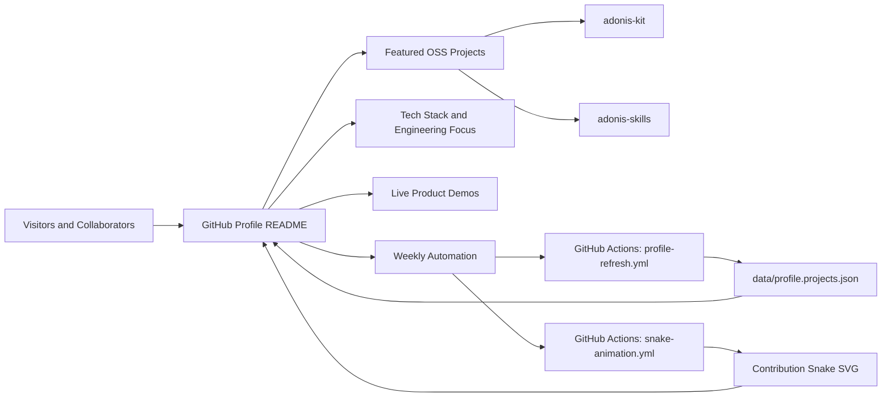

  

  

## About Me

- Open-source engineer shipping practical React components and developer tools.
- TypeScript enthusiast focused on reusable UI systems and automation workflows.
- Turning internal scripts into production-ready OSS packages.
- Prioritizing clean architecture, measurable outcomes, and fast iteration.

## Tech Stack

  

  

Full tech stack details

### Backend

- Node.js, TypeScript, API Design
- PostgreSQL, Messaging Patterns

### DevOps / Infra

- Docker, GitHub Actions
- Nginx, Cloudflare, Deployment Automation

### Frontend

- React, Next.js, Tailwind CSS
- shadcn/ui, Vite, Component-driven Development

### AI / Tools

- OpenAI API integrations
- Token and prompt workflow tooling
- Engineering automation scripts

## Achievements

  

## GitHub Stats

  
  

  

## Recent Activity

  

## Contribution Snake

<picture>
  <source media="(prefers-color-scheme: dark)" srcset="https://raw.githubusercontent.com/Adonis0123/Adonis0123/output/github-snake-dark.svg" />
  <source media="(prefers-color-scheme: light)" srcset="https://raw.githubusercontent.com/Adonis0123/Adonis0123/output/github-snake.svg" />
  
</picture>

## Featured Projects

### 1) adonis-kit

Production-ready engineering kit for building and scaling developer-focused products.

- Live Demo: [adonis-kit.vercel.app](https://adonis-kit.vercel.app/)
- Repository: [Adonis0123/adonis-kit](https://github.com/Adonis0123/adonis-kit)
- Core Tech: React, TypeScript, Vercel, UI System

### 2) adonis-skills

Skill framework for reusable AI engineering workflows and team-level productivity.

- Live Demo: [adonis-skills.vercel.app](https://adonis-skills.vercel.app/)
- Repository: [Adonis0123/adonis-skills](https://github.com/Adonis0123/adonis-skills)
- Core Tech: TypeScript, Workflow Automation, Tooling Architecture

### 3) Recently Active Repositories (Auto-refreshed weekly)

<!-- RECENT_REPOS:START -->
- **Pending auto-refresh #1** - Automatic selection will run in GitHub Actions when GitHub API is reachable. (Tech: N/A | Last update: unknown)
- **Pending auto-refresh #2** - Automatic selection will run in GitHub Actions when GitHub API is reachable. (Tech: N/A | Last update: unknown)
- **Pending auto-refresh #3** - Automatic selection will run in GitHub Actions when GitHub API is reachable. (Tech: N/A | Last update: unknown)
<!-- RECENT_REPOS:END -->

## How This Profile Works

## Contact

  
  

