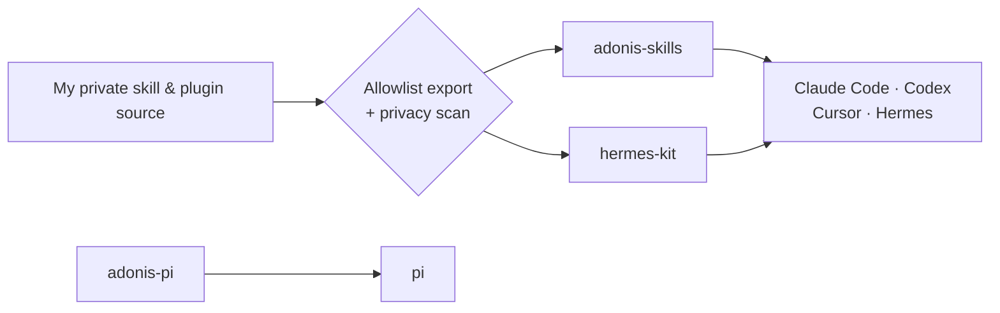

<p align="center">
  Frontend engineer (React · TypeScript) turned coding-agent toolsmith.<br />
  I package the habits that make agents reliable — review loops, workflow gates, permission gates — into things you can install in one line.
</p>

<!-- PROFILE_STATS:START -->
<p align="center">
  <b>36</b> published skills · runs in Claude Code · Codex · Cursor · Hermes · pi · <b>104</b> public commits in the last 30 days
</p>
<!-- PROFILE_STATS:END -->

## Featured Projects

### [sideby](https://github.com/Adonis0123/sideby)

<a href="https://www.npmjs.com/package/sideby"></a> <a href="https://github.com/Adonis0123/sideby/stargazers"></a> <a href="https://github.com/Adonis0123/sideby/commits"></a>

Run every AI coding account side by side: Claude Code, Codex, Grok Build and pi. Each account gets its own directory and terminal, all of them share one set of skills, hooks and rules, and one local panel shows every account's 5-hour and 7-day quota. Out of room? `sideby next` starts the account with the most left. No network calls, no token reads.

```bash
npm i -g sideby && sideby new claude work && sideby ui
```

<p>
<a href="https://github.com/Adonis0123/sideby">
  <picture>
    <source media="(prefers-color-scheme: dark)" srcset="https://raw.githubusercontent.com/Adonis0123/sideby/main/docs/assets/panel-dark.png" />
    <source media="(prefers-color-scheme: light)" srcset="https://raw.githubusercontent.com/Adonis0123/sideby/main/docs/assets/panel.png" />
    
  </picture>
</a>
</p>

How my skill, plugin and pi projects fit together:


```mermaid
flowchart LR
  SRC["My private skill & plugin source"] --> GATE{"Allowlist export<br/>+ privacy scan"}
  GATE --> SK["adonis-skills"]
  GATE --> HK["hermes-kit"]
  SK --> HOSTS["Claude Code · Codex<br/>Cursor · Hermes"]
  HK --> HOSTS
  PI["adonis-pi"] --> P["pi"]
```

### [adonis-skills](https://github.com/Adonis0123/adonis-skills)

<a href="https://github.com/Adonis0123/adonis-skills/stargazers"></a> <a href="https://github.com/Adonis0123/adonis-skills/commits"></a>

Agent-agnostic skills for coding agents: review loops, workflow gates, MCP setup, Git delivery and local environment audits. Works in Claude Code, Codex, Cursor, Hermes or any agent that reads `SKILL.md`. · [Live site](https://adonis-skills.vercel.app/)

```bash
npx skills add adonis0123/adonis-skills --list
```

### [hermes-kit](https://github.com/Adonis0123/hermes-kit)

<a href="https://github.com/Adonis0123/hermes-kit/stargazers"></a> <a href="https://github.com/Adonis0123/hermes-kit/commits"></a>

Plugins, skills and field notes for running [Hermes Agent](https://github.com/NousResearch/hermes-agent) day to day, plus docs for a patched Hermes fork. The skills also install into Claude Code and Codex.

```bash
hermes skills tap add Adonis0123/hermes-kit
```

### [adonis-pi](https://github.com/Adonis0123/adonis-pi)

<a href="https://github.com/Adonis0123/adonis-pi/stargazers"></a> <a href="https://github.com/Adonis0123/adonis-pi/commits"></a>

A Pi Package that brings my Claude Code habits to [pi](https://github.com/earendil-works/pi) without forking it: a permission gate, attention notifications, a Claude Code–compatible `AskUserQuestion` tool and the `pin` multi-account launcher.

```bash
git clone https://github.com/Adonis0123/adonis-pi && export PATH="$PWD/adonis-pi/bin:$PATH"
pin setup 1
```

### [gemini-chrome-autoinstall](https://github.com/Adonis0123/gemini-chrome-autoinstall)

<a href="https://github.com/Adonis0123/gemini-chrome-autoinstall/stargazers"></a> <a href="https://github.com/Adonis0123/gemini-chrome-autoinstall/commits"></a> <a href="https://github.com/Adonis0123/gemini-chrome-autoinstall/releases"></a>

A self-healing wrapper that keeps [Gemini-in-Chrome](https://github.com/appsail/Gemini-in-Chrome) working after Chrome updates: it watches for version changes and repairs `Local State` only when it is safe to write. macOS and Windows.

```bash
curl -fsSL https://raw.githubusercontent.com/Adonis0123/gemini-chrome-autoinstall/master/install.sh | bash
```

## Skill of the Week

A different skill from [adonis-skills](https://github.com/Adonis0123/adonis-skills) every week.

<!-- SKILL_OF_WEEK:START -->
**[local-web-surface](https://github.com/Adonis0123/adonis-skills/tree/HEAD/skills/local-web-surface)** — Build or extend a persistent macOS local web surface when the request includes a stable *.localhost URL, an existing loopback daemon/gateway, login startup, or…

```bash
npx skills add adonis0123/adonis-skills --skill local-web-surface
```
<!-- SKILL_OF_WEEK:END -->

## Shipped This Week

My latest public commits, refreshed weekly.

<!-- SHIPPED_THIS_WEEK:START -->
- `adonis-skills` [✨ feat(file-tidy): add a skill that files Desktop, Downloads and home files into a numbered Root](https://github.com/Adonis0123/adonis-skills/commit/141db64cdf465b6d3277bd6d61eba0ca0ac21b1b) · 2026-10-08
- `sideby` [📝 docs(badge): note that Grok hides its status line on the welcome screen](https://github.com/Adonis0123/sideby/commit/abc90d5726e0ad90e9a93180961d861b0f116a3c) · 2026-10-08
- `sideby` [🔖 chore(release): v0.3.0](https://github.com/Adonis0123/sideby/commit/03563471a6ddbe25668d121ff265b13c3960a73b) · 2026-10-08
- `sideby` [✨ feat(launch): tell the Host which account it is, and an optional title badge](https://github.com/Adonis0123/sideby/commit/078681a626954173f40dbdc6c7f054b50bf6b0dd) · 2026-10-08
- `sideby` [📝 docs(readme): calmer banner in the Panel's blue](https://github.com/Adonis0123/sideby/commit/1218716b9ee6a08be9fa8dc839903620bac349bb) · 2026-10-08
<!-- SHIPPED_THIS_WEEK:END -->

## More Projects

Auto-selected every week from my most recently pushed public repositories.

<!-- RECENT_REPOS:START -->
- **[til-garden](https://github.com/Adonis0123/til-garden)** - Today I Learned notes on AI agents, frontend and developer tools (Last update: 2026-07-14)
- **[adonis-kit](https://github.com/Adonis0123/adonis-kit)** - Production-ready engineering kit for building and scaling developer-focused products (Tech: `react`, `typescript`, `ui-components`, `vercel` | Last update: 2026-02-18)
<!-- RECENT_REPOS:END -->

## Latest TIL

Fresh notes from [TIL Garden](https://adonis-til.mintlify.app/introduction), refreshed weekly.

<!-- LATEST_TIL:START -->
- [Skills for Real Engineers：Matt Pocock 的可组合 Agent Skills](https://adonis-til.mintlify.app/ai/mattpocock-skills) · 2026-07-14
- [Next.js 服务端与客户端渲染原理：先别背名词，先看一条请求怎么走](https://adonis-til.mintlify.app/frontend/nextjs-rendering-principles) · 2026-05-08
- [给 Claude Code 装上工程纪律：agent-skills 插件实战指南](https://adonis-til.mintlify.app/ai/agent-skills-guide) · 2026-04-22
<!-- LATEST_TIL:END -->

## About Me

- Frontend engineer based in Shenzhen, China, working mostly in React and TypeScript.
- These days I spend most of my time building tooling for coding agents: Claude Code, Codex, Cursor, Hermes and pi.
- Everything I publish is exported through an allowlist and a privacy scan before it leaves my machine.
- I write down what I learn at [TIL Garden](https://adonis-til.mintlify.app/introduction).

## Tech Stack

<p align="center">
  <a href="https://skillicons.dev">
    
  </a>
</p>

<details>
<summary>Full tech stack details</summary>

### AI Agent Tooling

- Claude Code, Codex, Cursor, Grok Build, Hermes Agent, pi
- Agent skills (`SKILL.md`), plugins, MCP servers

### Languages & Markup

- HTML, CSS, JavaScript, TypeScript
- Sass, Markdown, SVG, Regex

### Frameworks & Build

- React, Next.js, Astro, Tailwind CSS
- Electron, Vite, Webpack, Express

### Runtime & Tools

- Node.js, Git, VSCode, Figma
- Python, GitHub, Cloudflare Workers, CodePen, Stack Overflow

### Infra & DevOps

- PostgreSQL, Docker, GitHub Actions
- Nginx, Cloudflare, Vercel, Linux, Jenkins

</details>

## GitHub Stats

<p align="center">
  <a href="https://github.com/Adonis0123">
    
  </a>
  <a href="https://github.com/Adonis0123">
    
  </a>
</p>

## Contact

<p align="left">
  <a href="https://github.com/Adonis0123">
    
  </a>
  <a href="mailto:zhihua0123@qq.com">
    
  </a>
  <a href="https://adonis-til.mintlify.app/introduction">
    
  </a>
</p>

<picture>
  <source media="(prefers-color-scheme: dark)" srcset="https://raw.githubusercontent.com/Adonis0123/Adonis0123/output/github-snake-dark.svg" />
  <source media="(prefers-color-scheme: light)" srcset="https://raw.githubusercontent.com/Adonis0123/Adonis0123/output/github-snake.svg" />
  
</picture>

<p align="center">
  <sub>This profile is refreshed weekly by <a href="https://github.com/Adonis0123/Adonis0123/blob/main/.github/workflows/profile-refresh.yml">GitHub Actions</a> — and edited by coding agents.</sub>
</p>


